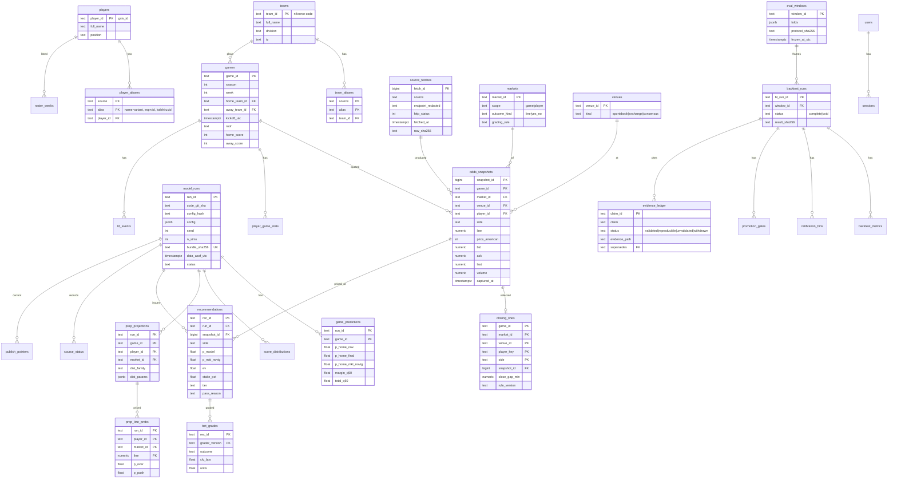

# NFL Model: full audit and overhaul plan

## Context
This plan comes from a request on 2026-09-28 for a full audit and plan of the NFL betting-model repo (`C:\Users\jviol\Downloads\nfl`). The bar is the sibling apps:
- `fantasy_football_dashboard`: rigor, the Next.js stack, and its test gates.
- `nba`: an R sibling ported *from* this repo, with a mature walk-forward backtest and governance layer.

The request covers:
- a full UI redo, because the current report "looks completely like AI slop"
- exact graphing and theming
- a backtest that can be reproduced exactly
- the model specification and the docs
- player props, including every touchdown market
- odds sourcing
- the data model (ERD) and security

The audit found that the numbers the model shows today are unreliable:
- **No valid backtest exists.** The headline metrics were hardcoded, mocked, or leaked outcomes.
- **Several bugs change the output:** command-line arguments are dropped, and shrinkage pushes probabilities away from the market.
- **Props labels are wrong on every row.**

So correctness and a real backtest come before the new UI. The UI will only display numbers the evidence supports.

**Evidence base for this plan:** three read-only audits (model/backtest, props/scrapers/UI, reference apps); a live Playwright render of the current report at 1440px and 390px; the dataviz palette validator; Context7 and web research; and live keyless probes of ESPN, Kalshi and nflverse on 2026-09-28. Every finding below cites file:line. The full ledger is committed as `reports/2026-09-28/AUDIT.md` in Phase 0.

## Decisions made with the user (2026-09-28)
| Topic | Decision |
|---|---|
| Delivery | A web app on the FF stack: Next.js 16, React 19, Tailwind 4, Drizzle, Neon Postgres, Vercel. R stays the model engine. |
| Audience | Both: a private decision desk and a public read-only view. |
| UI | Full redo with the **Broadcast Line** direction (below). |
| Backtest | Games and props, pre-registered, walk-forward, point-in-time, hash-locked windows. **Prioritized now.** What the public sees is decided by its results. |
| Odds data | **Keyless only:** no API keys and no free trials. Keyless sources were found and probed (see the data strategy section). |
| Deletions | Approved as one batch at a checkpoint, with usage evidence, in a dedicated PR. |

---

## 1. Audit summary (IDs are used throughout)

### Game model: critical
| ID | Finding | Evidence |
|---|---|---|
| M1 | The CLI week/season are discarded because `config.R` is re-sourced and resets SEASON=2025, WEEK=22. | `NFLsimulation.R:2422-2423`, `config.R:33,40` |
| M2 | Dynamic shrinkage *anti-shrinks*: `extra = 0.55-0.70 = -0.15`, then `p=(1-extra)p+extra·mkt`. | `NFLsimulation.R:8100-8127` (verified) |
| M3 | A second shrink, so the effective result is ≈0.345·blend + 0.655·mkt. | `NFLmarket.R:2217-2224` |
| M4 | The production calibrator was fit on `pnorm((home_score-away_score+noise)/13)`, i.e. outcome leakage. Its test Brier is 0.105. | `ensemble_calibration_implementation.R:82-83` |
| M5 | Look-ahead leakage: HFA/RHO/PPG are computed over all seasons, and each team's max-week strength is joined to every game. "Leakage_free=TRUE" is false. | `:3565-3683, :7448-7452, :5675` |
| M6 | The backtest engine is a reduced model, not the production path. | `week_inputs_and_sim_2w :5344-5528` |
| M7 | Headline claims can't be reproduced: Brier 0.211, "2,282 games", 67.1%, 538/FPI "Rank #2" (mock data), r=0.75/0.60/0.50/0.40. | `simplified_baseline_comparison.R:252`, `professional_model_benchmarking.R:50` |
| M8 | Train/serve skew in the blend. | `:7294` vs `:8001` |
| M9 | The 10-season GLMM prior has no season term and gets 35–70% weight. | `:4408-4428` |
| M10 | Spread sign is inverted: `plogis(-sp/3.5)` is fed nflreadr `spread_line`, where positive means home favored. | `:6568-6571, :6609-6643` (verified) |
| M11 | A missing market probability is silently filled with the model probability. | `:6680` |
| M12 | Sobol `scrambling=0` ignores the seed, so every game uses the same uniform stream (wrong cross-game correlation). | `:5316` (verified) |

### Props
| ID | Finding | Evidence |
|---|---|---|
| P1 | The scalar edge-quality classifier is applied to whole columns, so every row reads "Review". | `correlated_props.R:1467`, `props_config.R:273` |
| P2/P3 | Recommendation and stake disagree; stake inputs default to the over side. | `NFLmarket.R:4235`, `correlated_props.R:1421` |
| P4 | Odds API props hit the wrong endpoint, and the parser iterates the data frame as a list. | `prop_odds_api.R:66-120` |
| P5 | 0 anytime-TD rows reach the output; the Yes/No sides are mis-mapped. | `baseline_props.csv`, `prop_odds_api.R:141-161,322` |
| P6 | Projections ignore week, injuries and depth charts, and fall back to synthetic "KC QB1". EV reaches +119.6%. | `data_sources.R:51-369` |
| P7 | Correlation uses the game total only; team score vectors go unused; no seed. | `correlated_props.R:447`, `NFLsimulation.R:8609` |
| P8 | Yards are modeled as a Normal clipped at 0; receptions as Poisson ignoring overdispersion. | `:406, :1040` |
| P9 | Joins use fuzzy names (A.St. Brown ↔ A.J. Brown). The team normalizer turns "KC" into "". LA/LAR mismatches break joins. | `prop_odds_api.R:549,573` |
| P10 | A duplicate, drifted, unused props engine. | `sports/nfl/props/props_pipeline.R` |
| P11 | Missing markets: first/2+/last TD, pass TDs, completions, INTs, attempts, longest, alt lines, SGP. | |
| P12 | EV is computed on the raw price with no devig; line shopping ignores which side the model likes. | `:693-712, :628` |

### Sources and scrapers
| ID | Finding | Evidence |
|---|---|---|
| S1 | ToS/legal risk: a private ScoresAndOdds AWS endpoint called with a spoofed user agent; OddsTrader/Covers are dead but still called; a vendor JS bundle is committed; the ESPN robots check is hard-coded TRUE. | `injury_scalp.R:386` |
| S2 | First-source-wins cache with no timestamps or snapshots, so nothing can be backtested. | `prop_odds_api.R:859-910` |
| S3 | Weather: no timeout, a cache that never expires, and neutral sites mapped to Kansas. | |
| S4 | Game lines are the nflreadr close with no timestamp. | |

### UI (live render)
| ID | Finding |
|---|---|
| U1 | The sticky search bar covers the tabs. |
| U2 | The gt header renders below the data; spanners read "????". |
| U3 | Overflows at 1440px, and at 390px (593px wide). |
| U4 | 5 static base-R PNGs: truncated labels, no legend, n=1 charts. |
| U5 | three.js loaded from a CDN without SRI; the WebGL loop runs under reduced-motion. |
| U6 | Nested `<html>`. |
| U7 | The props tab has no search, sort, kickoff, stake or timestamp. |
| U8 | 1 aria attribute, 0 roles. |
| U9 | Boilerplate fills the fold. |
| U10 | "Claude coral" on near-black, with Inter: the generated-page look. |

### Tests, CI, hygiene, docs
| ID | Finding |
|---|---|
| T1 | `verify_repo_integrity.R` FAILS (56/57). |
| T2 | No test executes sim, blend, shrink or scoring; the props test swallows errors; about 200 skips. |
| T3 | `run_matrix` only sources files. |
| T4 | CI uses R 4.4.0 vs renv 4.5.1; testthat is not in renv.lock; `rg` is missing in CI. |
| H1 | 165 run_logs tracked despite .gitignore; invalid rds files tracked; ~2,100 lines of fallback copies; `standardize_join_keys` defined 3 times; unsourced `core/`; the `nul` file; version drift (2.7.0 / 2.9.0 / 2.9.3 / 2.9.4). |
| D1 | README/CLAUDE.md/DOCUMENTATION/GETTING_STARTED contradict config and each other (60% vs 70% shrinkage, correlations, metrics). CHANGELOG is missing 2 commits. No LICENSE. |

### Security
| ID | Finding |
|---|---|
| SEC1 | The untracked `.claude/settings.json` allows blanket Bash/Edit/Write; `.claude/settings.local.json` is tracked. |
| SEC2 | `.gitignore` lacks `.Renviron`, `.env*`, `.claude/settings*.json`, `.playwright-mcp/`. |
| SEC3 | CDN script without SRI; no CSP. |
| SEC4 | Unescaped HTML fallback; export force-deletes an arbitrary path; `system()` on a built string. |

No committed secrets were found, and there is no `eval(parse())`.

### Cross-repo finding (for the user, not executed here)
CLV is defined as `model_prob − close` in both NFL (`NFLmarket.R:680`) and NBA (`nba/R/clv_tracking.R:158`). That is the most likely cause of NBA's constant −800 bps. The correct definition is `clv_bps = 10000·(p_close_novig(side) − p_taken_novig(side))`.

---

## 2. Keyless data strategy (probed live 2026-09-28)
| Need | Source (no key, no trial) | Verified coverage | Notes |
|---|---|---|---|
| Game closing lines (spread, total, ML) | nflverse schedules via nflreadr | 1999→now | No timestamp or book; labeled "consensus close". |
| Game open/close by book | ESPN core API `…/events/{id}/competitions/{id}/odds` | ~2023→now (DraftKings; ESPN BET 2023-25) | Pre-2023 lists providers but no open/close. |
| Game prices with history | Kalshi public API `KXNFLGAME`/`KXNFLSPREAD`/`KXNFLTOTAL` | ~late 2025→now | Hourly bid/ask/last candles. |
| **Prop prices with history, incl. TDs** | **Kalshi** `KXNFLANYTD`, `KXNFL2TD`, `KXNFLFIRSTTD`, `KXNFLPASSYDS`, `KXNFLRECYDS`, `KXNFLRSHYDS`, `KXNFLREC`, `KXNFLPASSTDS`, `KXNFLPASSCOMP`, `KXNFLPASSATT`, `KXNFLPASSINT`, `KXNFLRSHATT`, `KXNFLRRYDS`, `KXNFLLONGREC`, `KXNFLLONGRSH` | ~Dec 2025→now (spike measures the exact start) | `/historical/markets` plus `/historical/markets/{t}/candlesticks`. Deep liquidity (Nacua anytime TD: 747k contracts, 1–2¢ spread). A CFTC-regulated exchange's public market data, so no scraping. EV uses **ask + taker fee**; fair value = mid. |
| Prop openers, 2024–25 | ESPN core `…/odds/58/propBets` (ESPN BET archive) | 2024 season → ~wk13 2025 | Includes anytime/first/last TD, yards, receptions, completions, attempts, INTs, longest. Only **20–35% of rows keep prices**, and `lastUpdated` falls after kickoff, so `current` is not a close. Use `open` only, after a **selection-bias test** (outcome rate of priced vs unpriced rows). |
| Prop line movement going forward | ESPN core `…/odds/100/propBets` (DraftKings) | live only; gone after kickoff (404) | Lines (targets) with open→current, **no prices**. Full TD menu listed, but TD rows are empty. |
| Grading: stats and TD scorers | nflverse `load_player_stats`, `load_pbp` (`td_player_id`, play order), `load_snap_counts` | 1999→now | Keyless GitHub releases. |
| Injuries, depth, IDs | nflverse `load_injuries`, `load_depth_charts`, `load_ff_playerids` | | Replaces the ESPN HTML scrape. |

**Forward capture starts first (Phase 0).** Prop data disappears after kickoff, so every week without capture is lost for good. Phase 0 ships a minimal capture script with no dependency on the schema:
- It snapshots raw ESPN and Kalshi JSON to disk: Thu/Sat/Sun, and T-90 and T-15 before each kickoff window.
- Raw files are gzipped. They're archived as weekly GitHub Release assets and never committed.
- The script is later adapted into the Phase 2 provider layer.

**Retired:** the ScoresAndOdds private endpoint, OddsTrader, Covers, the committed vendor JS, the ESPN injury HTML scrape, and The Odds API code path (all keyed or dead). **HTTP policy for the keyless sources:**
- a truthful user agent and ≤1 request/second
- a 20s timeout, and retry with backoff on 429/5xx
- raw-response sha256 recorded in `source_fetches`
- a ToS matrix in `docs/odds-sources.md`

---

## 3. Target architecture
**Monorepo.** `model/` (R, renv, R 4.5.1), `contracts/`, `web/` (Next.js), `reports/YYYY-MM-DD/`, `docs/`, `.github/workflows/`. The `git mv` into `model/` is a separate PR in Phase 6, proven by identical golden-master hashes before and after.

**R → web contract: versioned snapshot bundles.**
- **What R writes.** `model/R/bundle_writer.R` (jsonlite + digest, both already in renv) writes `bundles/<cycle_id>/`. Its `manifest.json` records schema_version, bundle_kind, cycle_id, season, week, generated_utc, data_asof_utc, code_git_sha, code_dirty=false, config_hash, seed, n_sims, renv_lock_sha256, `files[{name, sha256, rows}]`, and `qa{ok, failures}`.
- **Schema owner.** The Drizzle schema is the single source of truth: `drizzle-zod` produces the zod schemas, which generate `contracts/schema/*.json` (CI fails on drift).
- **R validation.** The R side ports `nba/R/schema_validators.R`. Both languages must pass the `contracts/fixtures/{valid,invalid}` fixtures.
- **Ingest.** `web/scripts/ingest-bundle.ts`:
  1. Verifies hashes and the major schema version, then zod-parses.
  2. Upserts in one transaction, idempotent on `bundle_sha256`.
  3. If QA failed, it stores the run as `qa_failed` and leaves the publish pointer on the last-known-good run (the NBA `publish_policy` pattern).
  4. Revalidates the site.
- **Scheduling.** GitHub Actions cron runs R, then ingest; Vercel only serves pages.
- **Rejected alternative:** R writing directly to Postgres (two schema writers, credentials in R, no hashable evidence artifact).
- **Database:** Postgres only, locally (docker/Neon branch) and in production. Migrations are applied by a workflow step. FF's SQLite + pg split caused driver bugs, so it's not copied.

**ERD** (the full column list lives in `docs/data-contract.md`, written in Phase 6):


**Invariants enforced in the database:**
- `CHECK (tier='bet') = (stake_pct>0)`. This enforces P2.
- Append-only triggers on `odds_snapshots`, `source_fetches`, `closing_lines`, `eval_windows`, `backtest_*` and `bet_grades`. A re-grade is a new `grader_version`.
- An unmatched-entity queue replaces fuzzy joins.
- Odds are stored only when they change, to stay inside Neon's free 0.5 GB.

---

## 4. Design system: "Broadcast Line" (chosen by the user; palette validated)
**Subject.** Every NFL viewer already reads the two TV lines: the blue line of scrimmage and the yellow first-down line.
- **Market** = scrimmage blue. **Model** = first-down gold.
- **Edge** is the distance between them. This mapping holds on every page, chart and table.

**Palette.** Checked with the dataviz validator in both themes (`--pairs all`): light worst colorblind ΔE 11.0 and normal-vision ΔE 20.2; dark 10.6 and 20.2. Maximum of 3 series.

| Role | Light (surface `#fbfcfa`) | Dark "night game" (surface `#13201b`) |
|---|---|---|
| Market | `#2563d1` | `#4a86ea` |
| Model | `#b98600` | `#b08a0e` |
| Actual / close | `#d4456f` | `#d9577f` |

- **Diverging edge scale:** blue ↔ gray ↔ gold, so the sign means something.
- **Status colors** (governance tiers) are separate from series colors and always come with an icon and a label.
- **Themes:** light is the default. Dark is its own chosen palette, not a flip.

**Type.** Archivo variable (wdth 62–125, confirmed on Google Fonts), self-hosted via `next/font` with `axes:['wdth']`.
- Condensed widths for dense odds tables; expanded widths for team codes and scores.
- `tabular-nums` only in numeric columns and axes.
- No all-caps labels, mono micro-labels, eyebrow labels, numbered markers, glow, blur, gradients or particles.

**Hero: the Field.** Each game is a 0–100% strip, goal line to goal line.
- The blue scrimmage marker is the no-vig market; the gold line is the model; the shaded gap is the edge.
- Tapping a strip expands the simulated score distribution.
- Everything around it stays quiet: sentence-case copy and one border level.

**Charts.** Built with visx v4 (React 19 support shipped 2026-06-11) plus d3-scale/shape, and server-rendered.
- Every chart is a `<figure>` with a computed text summary, a table view, and a hover/focus layer.
- One axis, thin marks, a legend when there are 2+ series, and text in ink colors (never series colors). These follow the dataviz rules.
- Reduced motion is respected.

**Pages:**
| Route | Contents |
|---|---|
| `/` This Week | Field strips; sort and filter. |
| `/games/[id]` | Margin and total histograms with market markers; line movement per venue with kickoff and close markers; CLV. |
| `/props` | Filters (market, team, player, game, position); a TD tab (anytime/first/2+); the price, venue and captured_at; no-vig vs model. |
| `/evidence` | Reliability diagram; CLV distribution with a CI; ROI by edge decile; promotion gates; eval-window hashes; the ledger. |
| `/methodology` | Generated from config and the ledger. |
| `/data-health` | Freshness per source; the unmatched queue; QA status. |
| `/desk/*` | Private: recommendations and paper stakes. |
| `/login` | |

A responsible-gambling footer appears on every page. **Public content follows the evidence:** markets that pass their gates show model vs market and the edge; the rest show an "unvalidated" label and no picks; stakes are never public. The final policy is confirmed at checkpoint A7 against actual backtest results.

---

## 5. Phases, branches and approval checkpoints
Fix branches (`fix/*`) and feature branches (`feat/*`) are never mixed, which CLAUDE.md requires. Each STOP item from CLAUDE.md becomes a named checkpoint (A0–A8) where I pause for your approval.

**Order:** foundation → correctness → keyless data → **game backtest** → props correctness and v2 → **props backtest** → contract and DB → UI → docs. The UI never shows a number the backtest hasn't produced or labeled.

### Phase 0: Honest baseline, harness, capture (`chore/*`, `test/harness`, `spike/keyless-data`)
**Deliverables:**
- **Audit record.** Commit `reports/2026-09-28/AUDIT.md`, the full evidence ledger above.
- **Honest default.**
  - Move every claim listed under M7 into `docs/EVIDENCE_LEDGER.md` as **Withdrawn**; everything else is **Unvalidated**.
  - Paper staking (`STAKING_MODE="paper"`).
  - Report banner reads "Unvalidated model: research output."
  - `update_calibration_quality(leakage_free=FALSE)`.
- **Hygiene and security** (batch approved at A0):
  - `.gitignore` gets `.Renviron`, `.env*`, `.claude/settings*.json`, `.playwright-mcp/`, `bundles/`.
  - Untrack `run_logs/` and `.claude/settings.local.json`; replace the blanket Bash/Edit/Write allow with a scoped allowlist.
  - Delete the list in "Deletion batch" below.
  - Remove the three.js CDN script; escape the no-gt fallback.
- **Test harness.**
  - `setup.R` calls `stop()` if a module fails to load; `stop_on_failure=TRUE`.
  - A skip meta-test: only the live allowlist may skip.
  - Fix T1 so it checks config against the ledger.
  - `run_matrix.R` becomes an offline fixture run of the pipeline.
  - **Golden master:** record the current outputs for a fixture week (seeded), so later diffs are explained.
- **CI.** R 4.5.1, `setup-renv@v2`, `cache@v4`, install ripgrep, add testthat and httptest2 to renv (A0: new dependencies).
- **Forward capture** script plus workflow (section 2), starting immediately.
- **Keyless data probe** → `reports/<phase-0 date>/DATA_SOURCES_SPIKE.md`. It measures:
  1. Kalshi NFL series start dates and per-market game counts.
  2. ESPN BET prices retained per market and season, plus the **selection-bias test**.
  3. ESPN game open/close coverage by season.

  **GO rule:** anytime TD and 3 or more yardage markets must have ≥300 settled player-games with a pre-kickoff price. Below that, those markets are backtested **prospectively only** and labeled that way.

### Phase 1: Game-model correctness (`fix/*`; A1a: core engine and config defaults; A1b: extraction and removing the fallback copies)
The regression test is written first for every item (TDD).

| ID | Fix | Test |
|---|---|---|
| M1 | `R/run_config.R::resolve_run_config()`; delete the re-source at `:2422`. | Args "15 2024" → 2024 week 15. |
| M2, M3 | Remove dynamic shrinkage. One `apply_market_shrinkage()` wrapping `shrink_probability_toward_market` (`R/utils.R:191`) with one `MARKET_WEIGHT`, applied to the **no-vig** market. | `|p_final−mkt| ≤ |p_model−mkt|`; exactly 1 shrink stage. |
| M4, M8 | `CALIBRATION_METHOD="none"`. The loader rejects artifacts without a provenance manifest. Refit later with `make_calibrator` (`:7748`) on out-of-fold walk-forward predictions, and promote only through the gates. | The current rds is rejected. |
| M5, M6, M9 | `features_asof(season, week)` (every input's kickoff is before the cutoff). Extract `predict_week()`, used by both run_week and the backtest. GLMM on prior seasons only, with a season term. | **Leak canary** (an absurd future game leaves the feature hash unchanged); backtest output equals production output, bit-identical. |
| M10 | One `spread_to_home_prob()` in the nflreadr convention; delete the other maps. | `f(+7)>0.5`; `f(s)+f(−s)=1`. |
| M11 | Missing market → NA, `update_market_quality("partial")`, pass reason `no_market`. | Fixture game with no moneyline. |
| M12 | Per-game seed = hash(run_seed, game_id); `scrambling=1` or `rng="pcg"`. | Two games → different streams; same seed → identical. |

### Phase 2: Keyless odds layer (`feat/odds-layer`; A4: retire scrapers and sign off the ToS matrix)
- Port `nba/R/providers/provider_interface.R`. Build `provider_nflverse.R`, `provider_espn_core.R` (game open/close, the ESPN BET archive, DraftKings prop lines) and `provider_kalshi.R` (historical candles and live), all using `R/odds/http.R` (httr2).
- Normalize into the `odds_snapshots` shape.
- **Closing rule:** the last snapshot before kickoff with the same line. Kalshi's close is the last pre-kickoff hourly mid; a gap over 60 minutes is flagged `stale` and left out of headline CLV.
- Canonical IDs: `nflreadr::clean_team_abbrs`, `load_ff_playerids`, and alias tables. Kalshi player UUIDs and ESPN athlete IDs go in `player_aliases`.
- Tests use httptest2 fixtures only; there's a manual `live-smoke` workflow.

### Phase 3: Game backtest (`feat/backtest-games`; A2: you sign the protocol hash *before* any scoring)
**Ported from NBA:** `backtest/walk_forward.R`, hash-locked `eval_windows/*.json`, and `PROMOTION_POLICY.md`, where CLV is the primary gate, Brier must be non-inferior, and the honest default applies. Reuse `clv_block_bootstrap_ci` and the helpers in `market_governance.R`. The NBA CLV bug is not ported.

**Folds.** Expanding windows by NFL week; features from `features_asof`.
- Tune: 2018–2022.
- Confirm: 2023–2024.
- **Sealed holdout:** 2025, scored once.
- Prospective: 2026 onward.

**Metrics:** Brier, log loss, ECE, calibration slope, skill vs no-vig market, CLV bps (ESPN opens 2023+ and Kalshi mids 2025+), flat and paper-Kelly ROI by edge decile. **Statistics:** week-block bootstrap (B=10k), Diebold–Mariano with HLN correction, BH correction across markets.

**Circularity guard.** When the only line available is the nflverse close, only the **pre-shrink** model is scored against the close, and CLV is marked "not evaluable".

**Controls** (any failure voids the run):
- leak canary
- shuffled labels (skill CI must include 0)
- market-copy model (skill = 0)

**Output:** `reports/YYYY-MM-DD/backtest-games-v1/{PROTOCOL.md (hashed first), predictions.csv, metrics.json, RESULT.md}`, plus rows in the evidence ledger.

### Phase 4: Props correctness, then props model v2 (`fix/props-correctness` then `feat/props-model-v2`; A3: delete `props_pipeline.R`; A5: model changes)
**Fixes:**
| ID | Fix | Test |
|---|---|---|
| P1 | Vectorize the classifier. | The real post-processing, not `mapply`. |
| P2/P3 | `govern_prop_row()` returns side, tier and stake together. | 10k random inputs: stake>0 ⇔ tier bet. |
| P9 | ID joins only; fix the "KC"→"" normalizer. | |
| P12 | Devig per venue (`devig_american_odds`, `R/utils.R:150`; Kalshi = mid); EV at the best fresh price for the side the model likes, including Kalshi fees. | |

**Model v2:**
| ID | Change |
|---|---|
| P6 | `projections_asof()`: recency-weighted usage share × the sim's team volume × efficiency, with an empirical-Bayes prior. Outs are redistributed (NBA `usage_reallocation` idea). Depth from `load_depth_charts`. No synthetic players: a missing projection means the prop isn't priced. |
| P7 | Anchor each player to **its own team's** simulated points (vectors at `NFLsimulation.R:8609`) via rank→normal. Position ρ is estimated point-in-time. A within-team cannibalization factor. Seeded per (run, game, player, market). |
| P8 | Receptions/attempts/completions/INTs/pass TDs: negative binomial. Receiving yards: NB receptions × gamma yards per catch. Passing and rushing yards: gamma, chosen by pre-registered out-of-sample CRPS/log score. |
| P11 | **TD engine:** P(team TDs = k \| simulated team points), estimated from pre-cutoff pbp. Per-player Multinomial with a Dirichlet-shrunk TD share (red-zone usage from `R/red_zone_data.R`). Anytime = P(N≥1), 2+ = P(N≥2). First TD: team, then player, calibrated to pbp scoring order. "No TD" is priced too. Invariants: Σ first-TD probabilities + P(none) = 1, and anytime ≥ first. |

### Phase 5: Props backtest (`feat/backtest-props`; A5 protocol sign-off)
- **Same framework per market:** anytime/2+/first TD, receptions, yards, attempts, completions, pass TDs, INTs.
- **Grading:** stats from nflverse, TD scorers and order from pbp, DNP → void.
- **Venues:** Kalshi (with history), the ESPN BET archive (openers only, after the bias test), and forward-captured snapshots.
- **Extra metrics:** CRPS, PIT uniformity, and CLV where a close exists.
- Markets below the GO threshold are reported as **prospective / insufficient n**, never as validated.

### Phase 6: Monorepo move, data contract, DB (`chore/monorepo-move`, `feat/data-contract`; A6: web deps, Vercel/Neon provisioning, secrets)
- The `git mv` into `model/`, proven by golden-master hashes.
- `bundle_writer.R`; `contracts/`; web skeleton; Drizzle schema and migrations; ingest CLI.
- Workflows: `weekly-model.yml` (Wed/Sat/Sun), `odds-capture.yml`, `grade-week.yml` (Tuesday, plus the post-game historical close), `ci-model.yml`, `ci-web.yml`, `contract.yml`, `codeql.yml`, `security.yml`, `deploy-migrate.yml`.
- `permissions: contents: read` everywhere; only the ingest job gets `DATABASE_URL` and `REVALIDATE_TOKEN`.

### Phase 7: Web UI (`feat/web-ui`; A7: public launch gate)
- The pages from section 4.
- **Ported from FF:** `proxy.ts` CSP nonce, `securityHeaders.mjs`, next-auth v5 with scrypt and throttling, `requireUser()` on `/desk`, `slopScan.test.ts` (updated for this design system), `docsTruth.test.ts`, the `evidenceLedger` pattern, and `security/exceptions.json`.
- Server components select public columns only. A test proves stakes are never rendered on public pages.

### Phase 8: Docs and retiring the R HTML report (`docs/rewrite`; A8: delete `export_moneyline_comparison_html` and the gt report path)
- Rewrite README, GETTING_STARTED and CLAUDE.md, with numbers only from real runs, new STOP items, and correct commands.
- Split DOCUMENTATION into `docs/model-spec.md` (generated by `generate_model_spec.R`, the same source as `/methodology`), `backtest-protocol.md`, `PROMOTION_POLICY.md`, `data-contract.md` and `odds-sources.md`.
- Add `VALIDATION_REPORT.md` (generated) and `HANDOFF.md` (FF format).
- Add CHANGELOG entries, including the 2 missing commits.
- Unify the version string; add LICENSE (MIT, as DESCRIPTION already says; you confirm).

### Deletion batch (presented with usage evidence at A0 and A3; git history keeps everything)
- `core/`, `sports/nfl/config.R`, `sports/nfl/props/props_pipeline.R`
- The fallback copies in `NFLsimulation.R` (~140–2290), replaced by fail-loud `source()` of `R/` modules
- The duplicate `standardize_join_keys` (keep `R/utils.R:361`)
- `professional_model_benchmarking.R`, `simplified_baseline_comparison.R`, `rolling_validation_system.R`
- `ensemble_calibration_implementation.R` and its `.rds`
- `scripts/grid_search_results_copula.rds`
- `artifacts/oddstrader_playerprops.js`, `artifacts/tmp_check.R`
- The scraper code (`prop_odds_api.R:249-518`)
- `nul`, `.playwright-mcp/` (audit screenshots from this session)

**Moved, not deleted:** AUDIT.md, IMPROVEMENT_PLAN.md and docs/AUDIT_REPORT.md go to `reports/history/`. **Decided in Phase 0 after checking usage:** `validation/*.R`, `validation_pipeline.R`, `validation_reports.R`, the per-market files in `sports/nfl/props/*`, and `injury_scalp.R`.

---

## 6. Verification
**Gate at the end of every phase.** Actual output is quoted in the PR and in HANDOFF.md, then reconciled against this plan, then committed and logged in CHANGELOG/HANDOFF.
```
Rscript -e "testthat::test_dir('model/tests/testthat', stop_on_failure=TRUE)"   # pass/fail/skip counts
Rscript model/scripts/verify_repo_integrity.R                                      # N/N
Rscript model/scripts/run_matrix.R                                                 # offline fixture pipeline + bundle validates
Rscript model/scripts/run_all_audits.R                                             # (ported from NBA) manifest.json
```
(Before the Phase 6 move, the paths drop the `model/` prefix.)

**Per-phase gates:**
- **P0:** golden master recorded; docs-truth passes; capture workflow's first run archived; spike report.
- **P1:** leak canary; production = backtest parity; shrink invariant; spread-sign tests; every golden-master diff explained in the PR.
- **P3/P5:** controls pass or the run voids itself; rerunning `walk_forward.R --window <id>` reproduces an identical `result_sha256`; ledger rows written.
- **P6:**
  - `npm run typecheck && npm run lint && npx vitest run` (pg integration must not be skipped)
  - contract fixtures pass in both languages
  - ingest is idempotent (a second ingest changes 0 rows)
  - append-only triggers raise on UPDATE
- **P7:**
  - Playwright + axe with 0 serious/critical issues.
  - Screenshots at 390/768/1440 in both themes. I look at them myself; that visual check is part of the gate.
  - Checks for no horizontal overflow, reduced motion, security headers, a clean console, `/desk` redirecting anonymous users, public pages never showing stakes, and an ID-leak spec (no gsis IDs, `NA`, `NaN`, `undefined`, `????`).
  - Lighthouse: accessibility ≥0.95, performance ≥0.8, CLS <0.1, LCP <2.5s.
  - The slop scan passes.
- **End to end:** `Rscript model/run_week.R <week> 2026` → bundle → `npx tsx web/scripts/ingest-bundle.ts bundles/<cycle>` into local Postgres → `npm run dev` → full Playwright suite → a Vercel preview deploy passes the same suite.

---

## 7. Owner actions and connectors
- **Authorize before Phase 6** via `/mcp` or claude.ai connector settings: **Vercel** and **Neon**. These are needed for provisioning and deploys; this session cannot run OAuth.
- **GitHub:** the MCP server failed to connect (bad auth header), but the `gh` CLI is logged in as jviola1019 with repo scope, and that covers PRs.
- **Optional:** Serena (connection failed), Figma, Hugging Face. Not needed.
- **Working now:** Context7, Playwright, Chrome DevTools, the dataviz validator, and the `gh` CLI.
- **No odds API keys are needed** under the keyless strategy. The Vercel/Neon credentials (and later `DATABASE_URL`/`REVALIDATE_TOKEN`) go only into GitHub Actions environment secrets and Vercel env, never into code or chat.

## 8. Risks and how they're resolved
| Risk | Resolution |
|---|---|
| Kalshi prop history is short (~Dec 2025 onward) | Anytime TD has the deepest liquidity. Markets under the GO threshold are prospective-only and labeled that way, and forward capture grows the sample every week. |
| Exchange prices ≠ sportsbook prices | Venues are stored separately; EV is per venue, including fees; no mixing of venues in CLV. |
| ESPN archive selection bias | The bias test runs before use. If it fails, the archive is used for line movement only and never scored. |
| ESPN/Kalshi keyless API changes | Raw responses are archived with hashes; providers are behind one interface; failures are recorded in `source_status`. |
| Small NFL sample (~285 games/season) | Gates pool seasons. The honest default may last a full season, and that is the correct outcome. |
| Refactoring the 8,640-line script | Strangler-style extraction behind the golden master, parity tests and checkpoint A1b. |
| CLAUDE.md STOP rules vs overhaul scope | Named checkpoints A0–A8, separate fix and feature branches, no mixed PRs. |
| Late GitHub cron runs miss the close | The authoritative close comes from the post-game historical fetch (Kalshi candles); stale closes are flagged. |
| Neon free tier (0.5 GB) | Store odds only on change; raw data goes to Release assets; retention pruning. |

## 9. Execution method (after approval)
1. Commit this plan as the design spec: `docs/superpowers/specs/2026-09-28-nfl-overhaul-design.md`, together with `reports/2026-09-28/AUDIT.md`.
2. Write a detailed task plan per phase with **superpowers:writing-plans**, and execute with **subagent-driven-development** (independent tasks in parallel, TDD per task).
3. Checkpoints A0–A8 stop for your approval.
4. HANDOFF.md is updated at every phase, and context is reset between phases, following your global rules.
5. Phase 0's forward-capture step goes first so no more prop data is lost.
