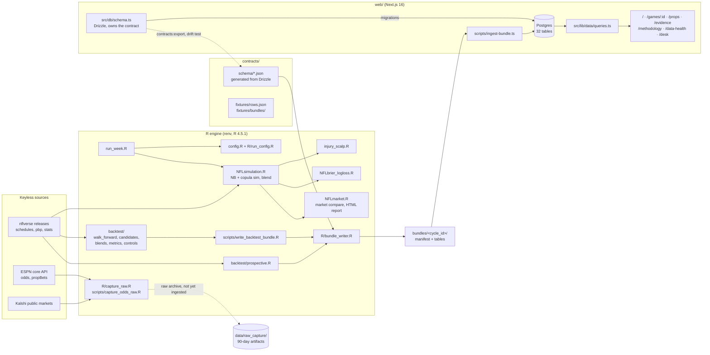

# Architecture and ERD scan — 2026-09-29

The scan covers the tree that results from merging every open overhaul PR onto `main` (`8adcc79`) in order: #194 A2 protocol, #195 game backtest v1, #196 Phase 1a, #197 deletion batch 2, #198 contract + web. Everything below was generated or checked on that combined tree. The ERD is dumped from the Drizzle schema with `getTableConfig`, and the spec comparison is computed, not eyeballed.

## Merge and gate check on the combined tree

| Check | Result |
|---|---|
| Merge #194 → #195 → #196 → #197 → #198 onto `main` | #194, #195 and #198 merge cleanly. #196 conflicts with #195 in `CHANGELOG.md` and `docs/EVIDENCE_LEDGER.md`; #197 conflicts in `CHANGELOG.md`. Every conflict is two entries added at the same spot, and keeping both sides resolves it. There are no code conflicts. |
| `scripts/verify_repo_integrity.R` | 60/60 |
| `scripts/run_tests.R` | 385 tests, 1360 passed, 1 failed, 3 errors, 17 skips. The failure (M15 snap test, which needs nflreadr data) and the 3 errors (`randtoolbox` not installed) are this container's missing packages. #196 alone shows the same 1+3 here, and its CI (R 4.5.1 with renv) is green. The combined tree introduces no new failure. |

## System

The simulator (`run_week.R`) does **not** emit a bundle yet. The live site shows the backtest candidates (prospective bundle) and the backtest evidence. Wiring the simulator into `bw_write_bundle()` is Phase 1b (point-in-time `predict_week()`).

## Module map

| Area | Files | Role | Notes |
|---|---|---|---|
| Entry and config | `run_week.R` (268 lines), `config.R` (1146), `R/run_config.R` | Weekly run. Season and week come from `options(nfl.season, nfl.week)` (M1). | |
| Simulation core | `NFLsimulation.R` (8572) | Features, NB + Gaussian-copula simulation, calibration, blend | 32 `if (!exists())` fallback copies of `R/` functions remain (spec deletion item; H1). |
| Market and report | `NFLmarket.R` (4868), `NFLbrier_logloss.R` (1180) | Market comparison, gt/HTML report, scoring | The HTML report retires in Phase 8 (A8). |
| Injury | `injury_scalp.R` (1580) | Injury impacts and snap weighting | M18 (current-week points never reach mu) and M19 (`practice_status` preferred) are open, awaiting approval. |
| R library | `R/` (14 files, 6018 lines): utils, data_validation, logging, playoffs, date_resolver, sleeper_api, red_zone_data, correlated_props, prop_odds_api, capture_raw, report_banner, test_policy, run_config, bundle_writer | Shared helpers | Batch 2 removes coaching_adjustments, simulation_helpers and model_diagnostics. |
| Props | `sports/nfl/props/` (7 files) | Position-level prop simulation | Known defects P1–P13; rebuilt in Phase 4. |
| Backtest | `backtest/` (17 files) | Pre-registered walk-forward shootout, `nfl_games_v1` | Hash-locked protocol. Result: no candidate beats the close. |
| Contract | `R/bundle_writer.R`, `contracts/` (34 files) | R side of the R → web contract | The zod and R validators run the same fixtures. |
| Web | `web/` (83 files) | Site and desk, Drizzle schema, ingest | Postgres only; pages render dynamically. |
| Scripts | `scripts/` (15) | tests, integrity, run matrix (10 artifacts), golden master, odds capture, bundle writer | |
| Tests | `tests/testthat/` (53), `web/src/**/*.test.ts` (8), `web/e2e/` (7 specs) | | CI: `ci.yml` (R), `ci-web.yml`, `golden-master.yml`, `odds-capture.yml` |

**Dependency edges** (non-test `source()`/`sys.source()`): `run_week.R → config.R, R/run_config.R, NFLsimulation.R`; `NFLsimulation.R → NFLmarket.R (path search), R/{utils,data_validation,logging,playoffs,sleeper_api}.R (tryCatch), config.R, injury_scalp.R, NFLbrier_logloss.R`; `NFLmarket.R → R/utils.R, R/report_banner.R, NFLbrier_logloss.R, props_config.R`; `backtest/prospective.R` and `scripts/write_backtest_bundle.R → backtest/*.R, R/bundle_writer.R`; `scripts/golden_master.R → NFLsimulation.R, R/run_config.R`. No module sources the deleted batch-2 files.

## Implemented ERD (generated from `web/src/db/schema.ts`)

```mermaid
erDiagram
  backtest_runs ||--o{ backtest_metrics : bt_run_id
  backtest_runs ||--o{ calibration_bins : bt_run_id
  backtest_runs ||--o{ clv_picks : bt_run_id
  backtest_runs ||--o{ promotion_gates : bt_run_id
  eval_windows ||--o{ backtest_runs : window_id
  games ||--o{ closing_lines : game_id
  games ||--o{ clv_picks : game_id
  games ||--o{ game_predictions : game_id
  games ||--o{ odds_snapshots : game_id
  games ||--o{ player_game_stats : game_id
  games ||--o{ prop_projections : game_id
  games ||--o{ recommendations : game_id
  games ||--o{ score_distributions : game_id
  games ||--o{ td_events : game_id
  markets ||--o{ closing_lines : market_id
  markets ||--o{ odds_snapshots : market_id
  markets ||--o{ prop_line_probs : market_id
  markets ||--o{ prop_projections : market_id
  model_runs ||--o{ backtest_runs : run_id
  model_runs ||--o{ game_predictions : run_id
  model_runs ||--o{ prop_line_probs : run_id
  model_runs ||--o{ prop_projections : run_id
  model_runs ||--o{ publish_pointers : run_id
  model_runs ||--o{ recommendations : run_id
  model_runs ||--o{ score_distributions : run_id
  model_runs ||--o{ source_status : run_id
  odds_snapshots ||--o{ closing_lines : snapshot_id
  odds_snapshots ||--o{ recommendations : snapshot_id
  players ||--o{ odds_snapshots : player_id
  players ||--o{ player_aliases : player_id
  players ||--o{ player_game_stats : player_id
  players ||--o{ prop_line_probs : player_id
  players ||--o{ prop_projections : player_id
  players ||--o{ roster_weeks : player_id
  players ||--o{ td_events : player_id
  recommendations ||--o{ bet_grades : run_id_rec_id
  source_fetches ||--o{ odds_snapshots : fetch_id
  teams ||--o{ games : away_team_id
  teams ||--o{ games : home_team_id
  teams ||--o{ roster_weeks : team_id
  teams ||--o{ td_events : team_id
  teams ||--o{ team_aliases : team_id
  venues ||--o{ closing_lines : venue_id
  venues ||--o{ odds_snapshots : venue_id
  auth_throttle {
    text key PK
    int failures
    timestamptz window_start
    timestamptz locked_until
  }
  backtest_metrics {
    text bt_run_id PK,FK
    text split PK
    text phase PK
    text candidate PK
    int n
    float brier
    float logloss
    float accuracy
    float ece
    float slope
    float slope_lo
    float slope_hi
    float skill
    float skill_lo
    float skill_hi
    float dm_p_better_bh
  }
  backtest_runs {
    text bt_run_id PK
    text window_id FK
    text run_id FK
    text status
    text result_sha256
    text code_git_sha
    timestamptz generated_utc
    jsonb controls
    jsonb clv_summary
  }
  bet_grades {
    text run_id PK,FK
    text rec_id PK,FK
    text grader_version PK
    text outcome
    float clv_bps
    float units
  }
  bundle_ingests {
    text bundle_sha256 PK
    text cycle_id
    text kind
    text run_id
    text status
    timestamptz ingested_at
  }
  calibration_bins {
    text bt_run_id PK,FK
    text split PK
    text candidate PK
    int bin PK
    float p_mean
    float y_mean
    int n
  }
  closing_lines {
    text game_id PK,FK
    text market_id PK,FK
    text venue_id PK,FK
    text player_key PK
    text side PK
    int snapshot_id FK
    float close_gap_min
    text rule_version
  }
  clv_picks {
    text bt_run_id PK,FK
    text candidate PK
    text game_id PK,FK
    text side
    float clv_bps
    float units
  }
  eval_windows {
    text window_id PK
    jsonb folds
    text protocol_sha256
    timestamptz frozen_at_utc
  }
  evidence_ledger {
    text claim_id PK
    text claim
    text status
    text reason
    text evidence_path
    text supersedes
  }
  game_predictions {
    text run_id PK,FK
    text game_id PK,FK
    text candidate PK
    float p_home_raw
    float p_home_final
    float p_home_mkt_novig
    float margin_q50
    float total_q50
  }
  games {
    text game_id PK
    int season
    int week
    text game_type
    text home_team_id FK
    text away_team_id FK
    timestamptz kickoff_utc
    text roof
    bool neutral
    int home_score
    int away_score
  }
  markets {
    text market_id PK
    text scope
    text outcome_kind
    text grading_rule
  }
  model_runs {
    text run_id PK
    text kind
    text cycle_id
    int season
    int week
    text model_label
    text code_git_sha
    bool code_dirty
    text config_hash
    jsonb config
    int seed
    int n_sims
    text bundle_sha256
    timestamptz generated_utc
    timestamptz data_asof_utc
    bool qa_ok
    jsonb qa_failures
    text status
  }
  odds_snapshots {
    bigint snapshot_id PK
    int fetch_id FK
    text game_id FK
    text market_id FK
    text venue_id FK
    text player_id FK
    text side
    numeric line
    int price_american
    numeric bid
    numeric ask
    numeric last
    numeric volume
    timestamptz captured_at
  }
  player_aliases {
    text source PK
    text alias PK
    text player_id FK
  }
  player_game_stats {
    text game_id PK,FK
    text player_id PK,FK
    text stat PK
    float value
  }
  players {
    text player_id PK
    text full_name
    text position
  }
  promotion_gates {
    text bt_run_id PK,FK
    text candidate PK
    bool g1
    bool g2
    bool g3
    bool g4
    text brier_status
    text betting_value_status
  }
  prop_line_probs {
    text run_id PK,FK
    text player_id PK,FK
    text market_id PK,FK
    numeric line PK
    float p_over
    float p_push
  }
  prop_projections {
    text run_id PK,FK
    text game_id PK,FK
    text player_id PK,FK
    text market_id PK,FK
    text dist_family
    jsonb dist_params
  }
  publish_pointers {
    text pointer PK
    text run_id FK
    timestamptz updated_at
  }
  recommendations {
    text rec_id PK
    text run_id PK,FK
    int snapshot_id FK
    text game_id FK
    text candidate
    text side
    int price_american
    float p_model
    float p_mkt_novig
    float ev
    float stake_pct
    text tier
    text pass_reason
  }
  roster_weeks {
    text player_id PK,FK
    text team_id FK
    int season PK
    int week PK
    text status
  }
  score_distributions {
    text run_id PK,FK
    text game_id PK,FK
    text kind PK
    jsonb bins
  }
  source_fetches {
    bigint fetch_id PK
    text source
    text endpoint_redacted
    int http_status
    timestamptz fetched_at
    text raw_sha256
  }
  source_status {
    text run_id PK,FK
    text source PK
    text status
    timestamptz last_success_utc
    text detail
  }
  td_events {
    text game_id PK,FK
    int seq PK
    text player_id FK
    text team_id FK
  }
  team_aliases {
    text source PK
    text alias PK
    text team_id FK
  }
  teams {
    text team_id PK
    text full_name
    text division
    text tz
  }
  users {
    text id PK
    text email UK
    text password_hash
    int session_version
    timestamptz created_at
  }
  venues {
    text venue_id PK
    text display_name
    text kind
  }
```

## Drift from the spec ERD (§3)

Computed by parsing the spec's mermaid block against the schema dump. The spec has 30 entities; 32 are implemented.

| Kind | Item | Why | Action |
|---|---|---|---|
| Missing | `sessions` | Sessions are JWTs. Revocation works through `users.session_version`: seeding the user again bumps it, and `requireUser()` rejects stale tokens. | Keep. Update the spec and `docs/data-contract.md`. |
| Added | `clv_picks` | Per-pick CLV for the evidence histogram and its interval | Keep (append-only). |
| Added | `bundle_ingests` | Ingest log, the idempotency key (`bundle_sha256`) and the data-health history | Keep. |
| Added | `auth_throttle` | DB-backed login throttle (account, IP, global) | Keep. |
| Key change | `recommendations` PK `rec_id` → `(run_id, rec_id)`; `bet_grades` gains `run_id` (PK `(run_id, rec_id, grader_version)`, composite FK) | A second run of the same week collided on `rec_id`. The pg ingest test caught it, and migration 0002 fixes it. | Keep; spec update. |
| Key change | `game_predictions` PK `(run_id, game_id)` → `(run_id, game_id, candidate)` | One row per registered candidate (C0…K[E1]) | Keep. |
| Added columns | `model_runs`: kind, cycle_id, season, week, model_label, code_dirty, generated_utc, qa_ok, qa_failures | Manifest provenance, stored for data health | Keep. |
| Added columns | `backtest_runs`: run_id (FK model_runs), code_git_sha, generated_utc, controls, clv_summary | Evidence page and controls table | Keep. |
| Added columns | `games`: game_type, neutral; `recommendations`: candidate, game_id, price_american; `venues`: display_name; `odds_snapshots`: fetch_id; `evidence_ledger`: reason | Page needs, the fetch lineage FK | Keep. |
| Missing FK | `prop_line_probs → prop_projections` | The keys differ (`prop_line_probs` has no `game_id`) | Phase 4: add `game_id` to `prop_line_probs` and a composite FK. |
| Missing FK | `evidence_ledger → backtest_runs` ("cites"), `evidence_ledger.supersedes` self-FK | The ledger cites by `evidence_path` (a file) so claims can point at any artifact | Decide in Phase 8: add a nullable `bt_run_id` FK and a self-FK on `supersedes`. |
| Not built | Unmatched-entity queue | Belongs to the odds layer | Phase 2. |
| Not built | "Store odds only when they change" | No odds ingest yet: raw captures are archived, not loaded | Phase 2. |
| Empty tables | team_aliases, player_aliases, players, roster_weeks, source_fetches, odds_snapshots, closing_lines, prop_projections, prop_line_probs, bet_grades, player_game_stats, td_events, venues, markets, score_distributions | No producer yet | Phases 1b, 2, 4, 5. |

**Invariants.** Implemented as specified: `CHECK ((tier='bet') = (stake_pct>0))`, plus append-only triggers on odds_snapshots, source_fetches, closing_lines, eval_windows, backtest_runs, backtest_metrics, calibration_bins, promotion_gates, clv_picks and bet_grades. All are tested against Postgres. `evidence_ledger` is upserted, not append-only, so a withdrawn claim changes status in place; the spec doesn't require otherwise.

## Findings

1. **The simulator isn't connected to the contract.** `run_week.R` still writes only the gt/HTML report and `run_logs/`. Until Phase 1b emits a weekly bundle from `predict_week()`, the site's weekly numbers come from the backtest candidates and the game page has no margin/total histograms.
2. **H1 fallback copies.** 32 `if (!exists())` copies in `NFLsimulation.R` can shadow `R/` fixes. Replace them with fail-loud `source()` (spec deletion batch).
3. **Stale docs.** `docs/ARCHITECTURE.md` (v2.7.0, 2026-02-02) and `docs/API.md` predate the backtest, contract and web. Phase 8 rewrites them; this scan is the current reference until then.
4. **Pending deletions from the spec batch:** `ensemble_calibration_implementation.R` and its `.rds` (wait for the M4 calibrator decision), the H1 fallbacks, and the `prop_odds_api.R` scraper remnants (check them against the Phase 0 retirement).
5. **Parallel PRs touch the same docs.** CHANGELOG and ledger conflicts will recur with every parallel phase PR. Resolve by keeping both entries. After each merge, bring `main` into the next PR.
6. **Self-hosted throttle.** The per-IP throttle trusts `x-forwarded-for`. On Vercel that header is set by the platform; self-hosted deployments should put the app behind a proxy that overwrites it. The account and global throttles don't depend on it.
7. **Monorepo move not done.** The spec's `model/` layout is a separate Phase 6 PR, proven by identical golden-master hashes before and after.
